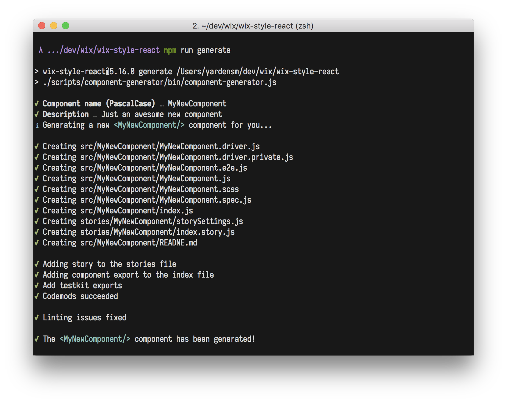

# Creating new components

## Using the component generator

A component generator is provided with the `wix-style-react` library to ease the process of adding
new components to the library. You can initiate the generator while running the following in the
root directory of the project:

```console
$ npm run generate
```



The generator will ask you for the new component name (must be in `PascalCase`) and a description
(which is optional). It'll generate a new component followed by the structure defined in the
[Component Structure](./COMPONENT_STRUCTURE.md) document, and will add the necessary `export`s to
the [index file](../../src/index.js) and to the [testkits](../../testkit/).

## Component story

The generator will also add a simple story file for the generated component. It will be placed under
the `Component` category by default. You should open the `storySettings.js` file of your new
component and modify it if needed. Also, make sure to re-arrange the [Stories index
file](../../stories/index.js) accordingly.
